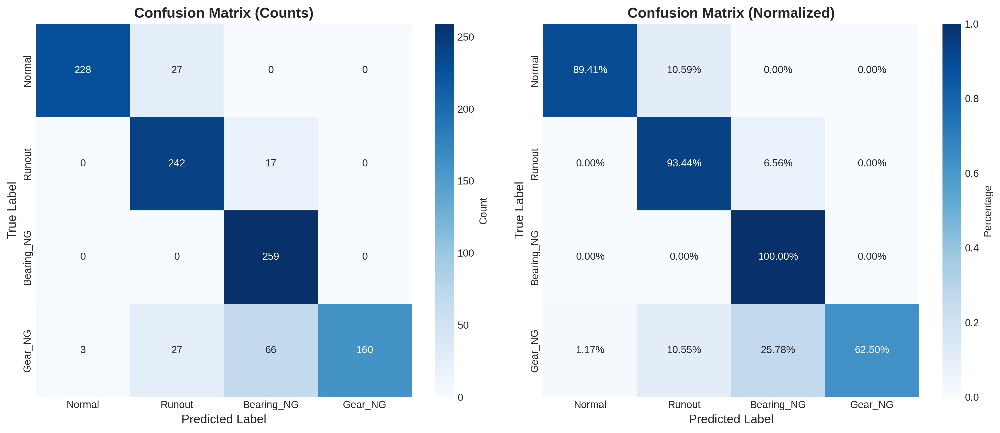
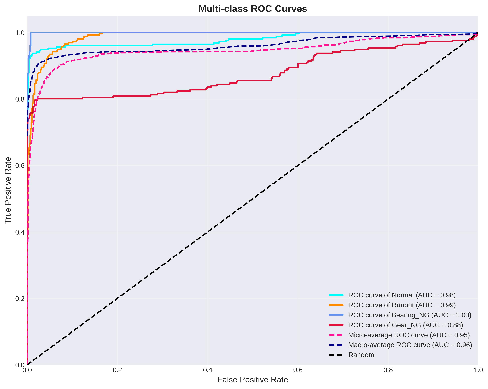
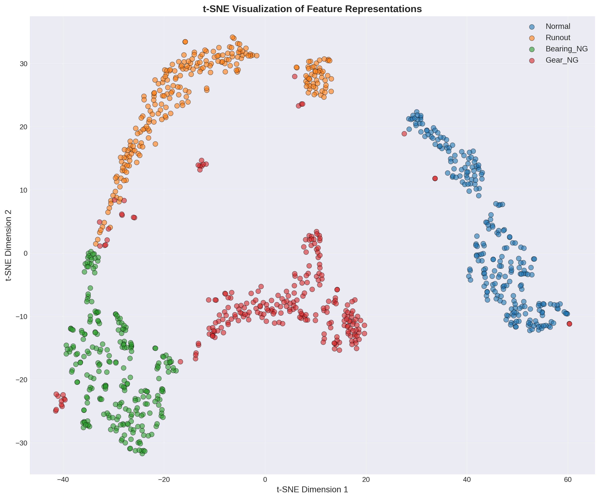
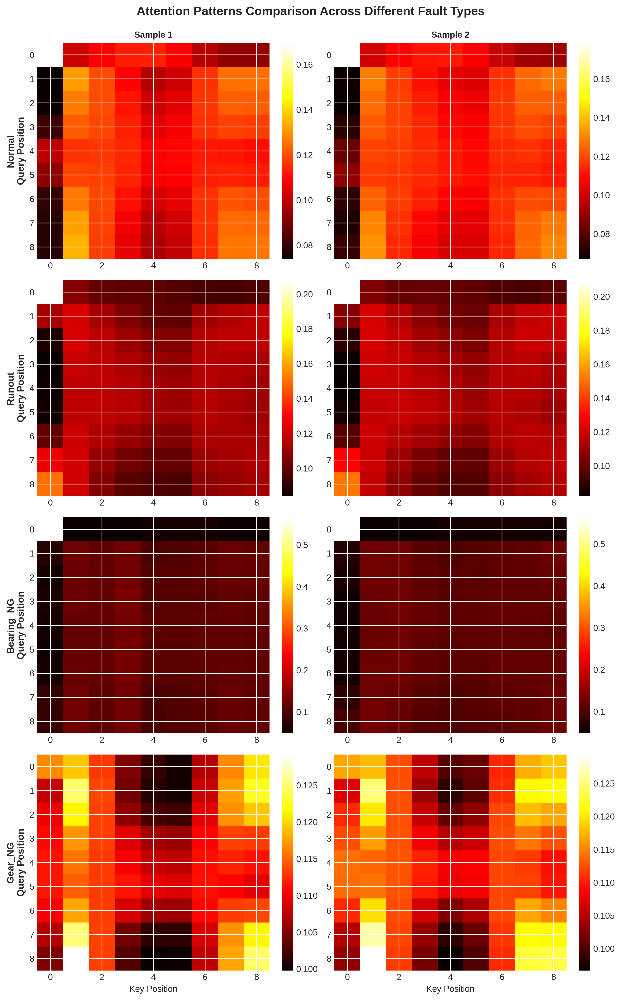

# ROT Fault Diagnosis - Comprehensive Analysis Report

## 1. Overview

This report presents a comprehensive analysis of the ROT fault diagnosis model, including classification results, feature representations, and model interpretability.

## 2. Classification Performance

### 2.1 Confusion Matrix

The confusion matrix shows the classification performance for each fault type.

**Classification Accuracy:** 86.39%

**Per-class Performance:**

| Class | True Positives | False Positives | False Negatives |
|-------|---------------|-----------------|-----------------|
| Normal | 228 | 3 | 27 |
| Runout | 242 | 54 | 17 |
| Bearing_NG | 259 | 83 | 0 |
| Gear_NG | 160 | 0 | 96 |

### 2.2 ROC Curves

The ROC curves demonstrate the model's discriminative ability for each class.

**AUC Scores:**

| Class | AUC Score |
|-------|----------|
| Normal | 0.9794 |
| Runout | 0.9882 |
| Bearing_NG | 0.9994 |
| Gear_NG | 0.8769 |
| Micro-average | 0.9452 |
| Macro-average | 0.9615 |

## 3. Feature Representation Analysis

### 3.1 t-SNE Visualization

The t-SNE visualization shows the distribution of learned features in a 2D space. Different fault types should form distinct clusters, demonstrating the model's ability to learn discriminative representations.

**Analysis:**

- Well-separated clusters indicate that the model has learned distinct feature representations for each fault type.
- Overlapping clusters suggest that some fault types may have similar characteristics.
- The spatial distribution reflects the model's internal representation of different fault patterns.

## 4. Model Interpretability

### 4.1 Attention Visualization Across Fault Types

The attention visualization compares attention patterns across different fault types. This shows which parts of the input signal the model focuses on when classifying different fault types.

**Key Observations:**

- Different fault types may exhibit distinct attention patterns.
- The attention maps reveal which temporal regions are most important for each fault type.
- Comparing attention patterns helps understand how the model distinguishes between different fault conditions.

## 5. Summary

- **Overall Accuracy:** 86.39%
- **Macro-average AUC:** 0.9615
- **Micro-average AUC:** 0.9452

The model demonstrates good performance in classifying ROT fault types, with attention mechanisms effectively focusing on relevant signal features.
